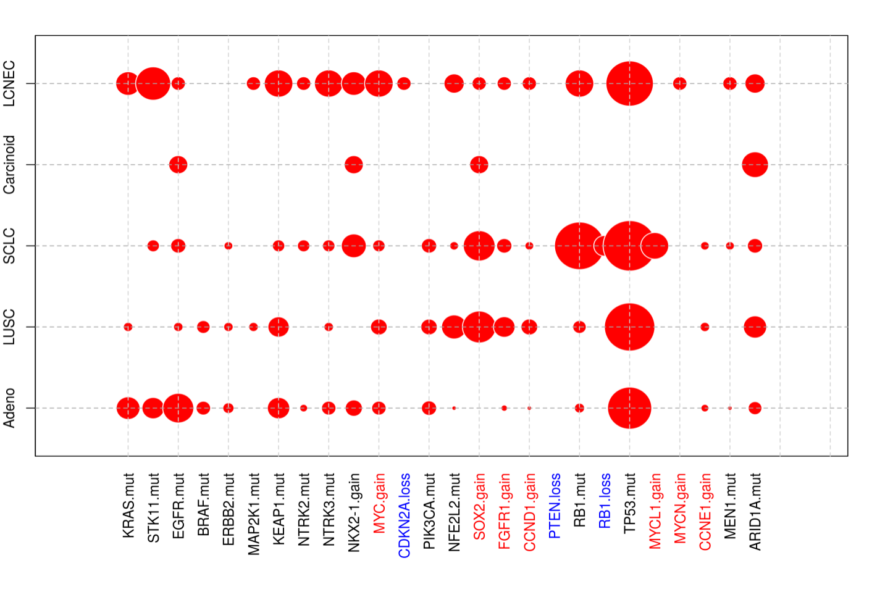

# projects_2024

## Project 1 - *survClust*

Project 1 goes over survClust and a few key example scenarios to emphasize its potential to analyze and integrate time to event data with other input data types. Final report is in the form of a `html` Rmarkdown file, named as `project1.html`. All code chunks are knitted in the same report to allow for code readability along with the final output. Raw code is in `project1.rmd`. A copy of the published survClust manuscript is also added as `survClust_GenomeMedicine.pdf`.

## Data Visualization focused projects

### Project 2 - *panelmap*

panelmap aids in visualizing discrete and continuous data for known groups. It was conceived at the time of survClust, as a tool to effectively convey unique clustering solutions driven by key genomic features.

panelmap was presented as a poster in Women in Statisics and Data Science in 2020. Here is a [link](https://arshiarora.com/talk/wsds2020/panelmap_aroraa_wsds.pdf) to the poster on my website.

Also, copied as `project2_panelmap_aroraa_wsds.pdf`

## Project 3 - Bubble plot

During our conversation we started discussing what is the best way to represent a contingency table. I found this problem interesting and wanted to research about it.

One of the common ways to present a contingency table is via a Mosaic plot. In R, [mosaic plots](https://cran.r-project.org/web/packages/vcdExtra/vignettes/mosaics.html) are implemented via the `vcd` package by Michael Friendly. While this package also helps with log-linear model fits, I wanted to share a small visualization that I created for a lung cancer study highlighting the proportion of genetic events across various subtypes in lung cancer.

An improvement to this plot could be to color the bubbles according to the actual sample size of events, highlighting any small sample sizes.

This figure also conveys any overlapping patterns seen across the subtypes, for example `TP53.mut` feature is seen across all subtypes except Carcinoids, `SOX2.gain`, `NFE2L2.mut`, `FGFR1.gain` co-occur in LUSC etc.
