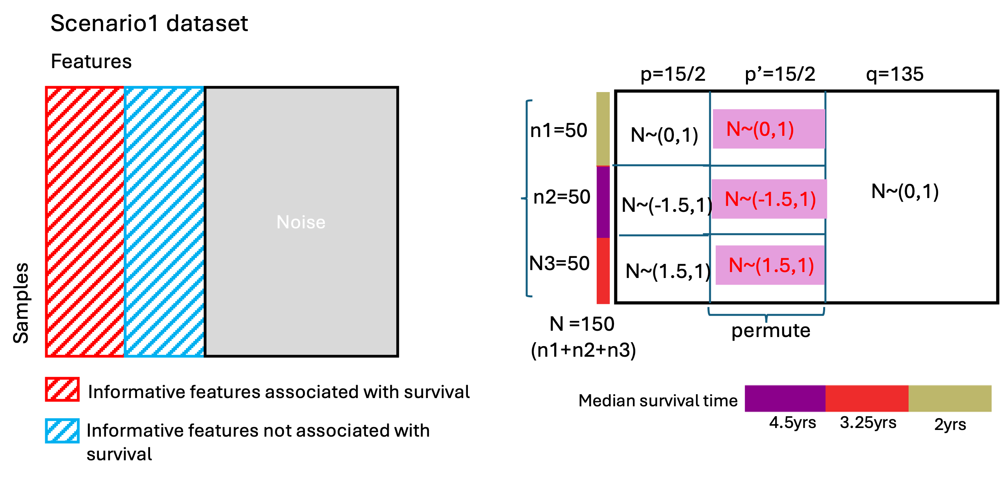

```{r setup, include=FALSE}
knitr::opts_chunk$set(
    eval=TRUE,
    echo = TRUE,
    message=TRUE,
    cache=FALSE, 
    warning = TRUE, 
    error = FALSE, 
    comment = "#", 
    tidy = FALSE, 
    results = "asis", 
    fig.width = 5, 
    fig.height=5)
knitr::opts_knit$set(
    root.dir = ".")
options(warn=1, width=200)

#packages
library(dplyr)
library(tidyr)
library(purrr)
library(ggplot2)
library(survival)
library(survminer)

library(doParallel)
library(ggridges)
library(DT)
library(gtsummary)

library(survClust)

# library(git2r)
# library(pander)

#r script with necessary functions 
source("scripts/simulate_survclust_data_fun.R")
source("scripts/utils.R")

my_col_pal <- c("darkkhaki","darkmagenta","firebrick2","cornflowerblue","green","darkblue","black","hotpink2")
```

# Background

In this report we will be delving into understanding **survClust** [^1] via simulating various scenarios in the form of datasets. The choice of using simulated datasets makes the context of data neutral and the findings from survClust more accessible. 
We will go over outputs from survClust on various scenarios highlighting the complex nature of time-event data and performance of survClust.

Note that, in this report my goal is to get you excited about survClust and to walk you through the rigorous testing performed via simulations and design of simulations to iron out the details of the methodology.  

For a deeper dive, please refer to the [published manuscript with *Genome Medicine*]( 10.1186/s13073-020-00804-8). survClust can be downloaded from my [GitHub repository](https://github.com/arorarshi/survClust)

```{r, echo=FALSE, out.width='40%', out.extra='style="float:right; padding:10px"'}

```

## What is survClust? 

Until now, sub-typing in cancer biology has relied heavily upon clustering/mining of molecular data alone, or unsupervised clustering of biological sequencing data such as gene expression data, DNA copy number data, gene mutation status etc [^2]. While this approach has been a cornerstone in understanding cancer disease biology, when the ultimate goal is to understand patient survival, a more focused approach with survival outcome is desired.   

survClust is an outcome weighted integrative supervised clustering algorithm, designed to classify patients according to their molecular as well as time-event data or end point of interest such as Overall Survival (OS), Progression Free Survival (PFS) etc. 

Below, we describe various scenarios where a supervised clustering approach such as survClust will be desired than more traditional unsupervised clustering approach such as `kmeans`. 

Also, here  is a quick [primer](https://www.emilyzabor.com/tutorials/survival_analysis_in_r_tutorial.html) by my colleague on survival data analysis.  

## Applications of survClust

Applications of survClust in cancer genomics have been established in previous work. See the list of scientific literature citing [**survClust**](https://scholar.google.com/scholar?oi=bibs&hl=en&cites=5819980793706217600)

A possible extension could be say, we observe the life of Apple MacBook Pros purchased in the year 2012 from years 2013-2018. 
We define an event as a laptop failing entirely (coded as 1) where it couldn't be revived by an Apple genius. If the MacBook is still functioning after 2018, we consider it as a non event, (coded as 0). If a MacBoook Pro drops from a study, or we are unable to keep track of their status aka loss of follow up, we will classify this event as censored. 

Apart from this we also collect various features after 1yr of usage - battery health, processor chip details, number of alive pixels on the screen, tests that could measure performance etc. 

We are interested in seeing if we can identify batches of MacBook Pros that have varied longevity (good or bad) based on the features that we collected. 

This is a very broad example and a proper study design might require a deep dive into understanding more about Apple MacBook Pros. For example, definition of an event is crucial when analyzing a study with time-event data. 


## survClust workflow - the tldr version {#wflow}

survClust is available as an R package and is under the submission process with [Bioconductor](https://www.bioconductor.org). Below we describe the proposed workflow of survClust method:

```{r, echo=FALSE}

```

`getDist` - Compute a weighted distance matrix based on outcome across given `m` data types. Standardization across data types (binary, continuous) to facilitate the integration process and accounting for non-overlapping samples is also accomplished in this step.

`combineDist` - Integrate `m` data types by averaging over `m` weighted distance matrices.

`survClust` and `cv_survclust` - Cluster integrated weighted distance matrices via `survClust`. Optimal `k` is estimated via cross-validation using `cv_survclust`. Cross-validated results are assessed over the following performance metrics - the **logrank statistic, standardized pooled within-cluster sum of squares (SPWSS)** and small cluster solutions with **size less than 5 samples**.

***Note: ***

(1) The input datatypes needs to be carefully pre-processed. See more details under the supplementary section of the manuscript.  

(2) `cv_survclust` is a wrapper function that cross-validates and outputs cluster assignments. If you run without cross validation and just the commands on its own (`getDist`, `combineDist` and `survClust`), you are **over-fitting!**. Running multiple (at least 10) rounds of cross validation is strongly recommended to arrive at a stable solution. Also, the cross-validation step is computationally intensive and one can reduce run times by using parallel computing. 

<details>

<summary>Read more about the performance metrics here and how to chose an optimal `k`</summary>

**Logrank test statistic**

The logrank test statistic[^3] is based on a non-parametric approach that quantifies survival difference between resulting subtypes and makes no assumption about the survival distributions.It tests the null hypothesis that there is no difference in survival between the groups.

The optimal k is the one with the maximum logrank statistic or at an inflection point where the statistic plateaus. 

**SPWSS**

SPWSS is calculated as the pooled within-cluster sum of squares and standardized by the total sum of squares similar to methodology used in the gap statistic [^4] to select the appropriate number of clusters.

The optimal number of clusters is where SPWSS is minimized and creates an “elbow” or a point of inflection, where addition of more clusters does not improve cluster separation. Since, this metric is standardized (lies between 0-1), it can also be used to compare individual runs of datasets that are measured over same samples.

**Cluster Size**

This metric computes the cluster size for each `k` across rounds of cross-validation. It records the instances where a round of cross validation returned a cluster size with less than 5 subjects. Such a solution might be  unreliable and perhaps over-fitted for that `k`. An optimal `k` should have the least amount of such instances across the total cross validation rounds.  

</details>

# Data scenarios
Below we simulate 3 data scenarios to highlight the functionality of survClust. Survival times for demonstration purposes will also be simulated where we assume they are derived from an exponential distribution. Also, note that in addition to simulated dataset being context free, we can also predetermine a ground truth that could give us a fair estimate of our method's performance. 

A handy function to simulate input data and survival data is provided - `simulate_survclust_data_fun.R`. 

## Scenario 1

Here we will simulate a dataset with three clusters, a total of 150 ($c_1=50, c_2=50, c_3=50$) samples and 150 features such that:

$c_1 \sim N(\mu = -1.5,\sigma=1)$

$c_2 \sim N(\mu = 0, \sigma=1)$ and
        
$c_3 \sim N(\mu = 1.5, \sigma=1)$

Note that, not all 150 features will be informative and we will only simulate about 15 (10%) features that will really drive the distinction between clusters. This is especially true in the context of human genome with about ~19,000 genes, where only a few of the genes will be actually associated with the disease biology and survival. 

These clusters will also have distinct median survival of  4.5, 3.25, and 2 yrs respectively.

More realistically, from the features that are distinct some are going to be associated with survival and while others remain distinct with no association to survival. We will simulate half of the informative features as distinct and associated with survival and remaining half as just distinct. 

```{r, echo=FALSE, fig.cap="fig:schematics of scenario1"}

```


```{r}
#simulating scenario 1
mat_scenario1 <- list()

#fixing the solution to simulated scenario1
true_soln_scenario1 <- data.frame(samples = paste0("S",1:150) , 
                                  cluster = c(rep(1,50), rep(2,50), rep(3,50)))

#function from simulate_survclust_data_fun.R to simulate input data
mat_scenario1[[1]] <- simulate_data_type(k=3, 
                                         k_size = rep(50,3), n_features = 150,
                                         mu = c(-1.5, 0, 1.5), sd = rep(1,3),
                                         perc_inform = 0.10, my_seed = 112,
                                         permute = TRUE)
#simulating survival data 
surv_scenario1 <- simulate_surv_dat(k=3, 
                                    k_size = rep(50,3),
                                    med_surv_times = c(4.5, 3.25, 2),
                                    max_survival = 10, my_seed = 112)

```

Below we plot the distribution of our simulated 3-class clusters and the survival curves in a Kaplan Meier plot. 

```{r, message=FALSE}

#long format to wrangle dta to plot ggridges and join the truth 
mat_scenario1_long <- mat_scenario1[[1]] %>%
    as.data.frame() %>%
    tibble::rownames_to_column(var = "samples") %>%
    tidyr::pivot_longer(., cols = -samples, names_to = "features") %>%
    left_join(., true_soln_scenario1, by ="samples") %>%
    mutate(cluster = as.factor(cluster))

#input data plot
p1 = ggplot(mat_scenario1_long, aes(x = value, y = cluster)) + geom_density_ridges(aes(fill = cluster), scale = 2, alpha = 0.6) + theme_bw() + scale_fill_manual(values = my_col_pal[1:3]) + ggtitle("cluster distribution of k=3 clusters, scenario1")

#KM plot
p2 = surv_scenario1 %>%
    tibble::rownames_to_column(var = "samples") %>%
    left_join(., true_soln_scenario1, by ="samples") %>%
    ggsurvplot(survfit(Surv(time, event) ~ cluster, data = .), data = ., 
               surv.median.line = "v", palette = my_col_pal) + 
    ggtitle("survival distribution across \n k=3 clusters, scenario1")


```

```{r, fig.width=10}
ggarrange(p1, (p2$plot + theme(plot.title = element_text(size = 13))), nrow=1)

```

We see that since only 10% of the features are informative and 90% are noise, the overall distribution appears to be uniform for the three clusters. 

The dashed vertical line from each survival curve represents the median survival rate for each group. See below the actual fit from `survfit`, as compared what we actually used in out simulation, $\lambda_{c1} = 4.5, \lambda_{c2}=3.25, \lambda_{c3} = 2$ 

```{r}
#survfit to compute median survival times
fit <- surv_scenario1 %>%
    tibble::rownames_to_column(var = "samples") %>%
    left_join(., true_soln_scenario1, by ="samples") %>%
    survfit(Surv(time, event) ~ cluster, data = .)

fit_median <- summary(fit)$table[,'median'] 

data.frame(cluster = gsub("cluster=","c",names(fit_median)), 
           `median survival(yrs)` = round(fit_median,2)) %>% 
  gt::gt(caption = "median survival times are from `survfit` fit")

```


### survClust run 

Once the simulated data is assembled, we proceed to running survClust via `cv_curvclust`. Each `k` will be cross-validated across 3-folds for 10 rounds where fresh resampling for folds is done at every round. Computation across each `k` (where k = 2 to 7 clusters) will be parallelized using `dopar` from package `doParallel`. 

This is wrapped up in a function by the name of `sim_cvrounds`, Expand the code section below. 

```{r, echo=TRUE, collapse=FALSE, results='markup'}
sim_cvrounds<-function(kk, simdat, simsurvdat, fold=3, cv_rounds=10){
    this.fold<-fold
    fit<-list()
    for (i in seq_len(cv_rounds)){
        fit[[i]] <- survClust::cv_survclust(simdat, simsurvdat,kk,this.fold)
    }
    return(fit)
} 
```

```{r}
registerDoParallel(cl <- makeCluster(6))

ptm <- Sys.time()

#each core performs computation for each k cluster
sim1_cv_fit <- foreach(kk=2:7) %dopar% sim_cvrounds(kk, simdat = mat_scenario1, simsurvdat = surv_scenario1)

ptm2 <- Sys.time()
stopCluster(cl)

tt = ptm2-ptm
```

The cross validation took `r round(as.double(tt, units = "mins"),2)` minutes to run. 

### Results and choosing k

All cross validated rounds of desired k clusters is then evaluated across 3 metrics - 

 * Logrank test statistic
 * Standardized pooled within sum of squares (SPWSS)
 * Number of reliable solutions 

More details on the metrics can be found [here](#wflow)  

In the plot below, the top-left plot is summarizing **logrank test statistic** over 10 rounds of cross-validated class labels across 3-fold cross-validation. Each dot is a solution from a cross validated round for that `k`. Here, we see that logrank peaks at `k=3`. 

The top-right plot is summarizing SPWSS or **Standardized Pooled Within Sum of Squares**. It appears that SPWSS decreases monotonically as the number of clusters `k` increases. The optimal number of clusters is where SPWSS creates an “elbow” , here the plot elbows at `k=3`

The last plot, on the bottom-left, shows for each `k` how many `k` class labels have `<=5` samples in 10 rounds of cross validation. In our case here, for `k=3` the number of classes with `<=5` samples is zero. 

```{r}
ss_stats <- getStats(sim1_cv_fit, kk=7, cvr=10)

p_lr <- plotStats_tidy(ss_stats$lr, highlight_k = 3)
p_lr <- p_lr + ylab("logrank test statistic")

p_spwss <- plotStats_tidy(ss_stats$spwss, highlight_k = 3)
p_spwss <- p_spwss + ylab("SPWSS")

p_clusize <- data.frame(k = paste0("k",2:7), cv_less_than_5 = ss_stats$bad.sol) %>%
    ggplot(aes(x=k, y = cv_less_than_5)) + 
    geom_line(col = "skyblue", group = "k") + geom_point() + 
    theme_minimal() + ylab("no. of cv solution with <=5 samples")

```


```{r, fig.width=8, fig.height=8}
ggarrange(p_lr, p_spwss, p_clusize, nrow=2, ncol=2)
```


```{r, message=FALSE}
#cv_voting creates a consensus of all solutions across the 10 cross validated rounds 
k3 <- cv_voting(cv.fit = sim1_cv_fit,
                dat.dist = getDist(datasets = mat_scenario1,
                                   survdat = surv_scenario1), 
                pick_k=3)
```

#### k=3

From the metrics above, we choose `k=3` as our optimal k. We can compare this with our simulated true solution - 

```{r}
#creating tab to store results 
tab <- true_soln_scenario1 %>% 
    left_join(., data.frame(sim_soln = k3, samples = paste0("S", 1:150)), 
              by = "samples")

tab %>% 
    dplyr::select(-samples) %>% 
    dplyr::rename("truth" = cluster) %>%
    gtsummary::tbl_summary(by = sim_soln) %>% modify_header(label = "**simulated solution**")

ari <- round(mclust::adjustedRandIndex(tab$sim_soln, tab$cluster),2)
```

The concordance between true and survClust predicted solution can be computed by Rand Index. 

The Rand Index is used to measure agreement between two classification labels. It has a maximum of 1 and a minimum of 0. Here 0 means the two data labels have no shared information and 1 means they are the same labels.

### Conclusion 

The concordance between the survClust reported solutions and truth class labels is high `r ari`, meaning survClust did a good job in recovering the true solution when features carry a mixed signal. Also, note that, even though only 10% of the features were informative, we split this in half to simulate features that were distinct and associated with survival and survClust was able to borrow from the 5% of the informative features. 


## Scenario 2

survClust can perform clustering on more than one data type and can output results by integrating the datasets. In genomic context, these different datatypes are the different biological avenues such as gene expression data (continuous), gene mutation status (binary) etc. capturing different layers of the tumor biology. 

Here we will simulate two dataset with three clusters, a total of 150 samples and 100 features with one dataset having strong clustering information and the other having weak clustering information. See below - 

*Dataset 1*

Simulate three clusters ($c_1=50, c_2=50, c_3=50$) such that

$c_1 \sim N(\mu = -1.5,\sigma=1)$,
        
$c_2 \sim N(\mu = 0, \sigma=1)$ and

$c_3 \sim N(\mu = 1.5, \sigma=1)$

*Dataset 2*

Simulate three clusters ($c_1=50, c_2=50, c_3=50$) such that - 

$c_1 \sim N(\mu = -0.5,\sigma=1)$,
        
$c_2 \sim N(\mu = 0, \sigma=1)$ and
        
$c_3 \sim N(\mu = 0.5, \sigma=1)$
        
Dataset2 can be interpreted as a modality that is adding noise to the modality of the data that explains the true survival association. For this scenario, the survival data remains same as scenario 1. 

```{r}

#scenario 2 set up
mat_scenario2 <- list()

true_soln_scenario2 <- true_soln_scenario1

#simulate data set but with strong cluster association 
mat_scenario2[[1]] <- simulate_data_type(k=3, 
                                         k_size = rep(50,3), 
                                         n_features = 100, 
                                         mu = c(-1.5, 0, 1.5), sd = rep(1,3),
                                         perc_inform = 0.10, my_seed = 123)


#simulate an additional data set but with weak cluster association 
mat_scenario2[[2]] <- simulate_data_type(k=3, 
                                         k_size = rep(50,3), 
                                         n_features = 150, 
                                         mu = c(-0.5, 0, 0.5), sd = rep(1,3),
                                         perc_inform = 0.10, my_seed = 123)

surv_scenario2 <- surv_scenario1

```

Below, we plot the distribution of only informative features across clusters across the two datasets. The dashed grey lines represent the means as we simulated across the two datasets. 

```{r, fig.width=8}

#long form of dataset to visualize cluster distribution 
#dataset1
mat_scenario2_dat1_long <- mat_scenario2[[1]] %>%
    as.data.frame() %>%
    tibble::rownames_to_column(var = "samples") %>%
    tidyr::pivot_longer(., cols = -samples, names_to = "features") %>%
    left_join(., true_soln_scenario2, by ="samples") %>%
    mutate(cluster = as.factor(cluster))

p1 <- ggplot(mat_scenario2_dat1_long %>% 
                filter(features %in% paste0("F",1:10 )), aes(x = value, y = cluster)) + 
    geom_density_ridges(aes(fill = cluster), scale = 2, alpha = 0.6) + theme_bw() + scale_fill_manual(values = my_col_pal[1:3]) + 
    ggtitle("distribution of informative features only, dataset1, scenario2") 

p1 <- p1 +
    theme(plot.title = element_text(size=10)) + 
    geom_vline(xintercept = c(-1.5,0,1.5), col = "grey", linetype = "dashed")

#dataset2
mat_scenario2_dat2_long <- mat_scenario2[[2]] %>%
    as.data.frame() %>%
    tibble::rownames_to_column(var = "samples") %>%
    tidyr::pivot_longer(., cols = -samples, names_to = "features") %>%
    left_join(., true_soln_scenario2, by ="samples") %>%
    mutate(cluster = as.factor(cluster))

p2 <- ggplot(mat_scenario2_dat2_long %>% 
                filter(features %in% paste0("F",1:10 )), aes(x = value, y = cluster)) + 
    geom_density_ridges(aes(fill = cluster), scale = 2, alpha = 0.6) + theme_bw() + scale_fill_manual(values = my_col_pal[1:3]) + ggtitle("distribution of informative features only, dataset2, scenario2")

p2 <- p2 + 
    theme(plot.title = element_text(size=10)) +
    geom_vline(xintercept = c(-0.5,0,0.5), col = "grey", linetype = "dashed")

ggarrange(p1, p2, nrow=1)
```

### survClust run 

In this section we will be performing weighted integrative clustering survClust via previously defined function `sim_cvrounds`.

```{r}
registerDoParallel(cl <- makeCluster(6))

ptm <- Sys.time()
sim2_cv_fit <- foreach(kk=2:7) %dopar% sim_cvrounds(kk, simdat = mat_scenario2, simsurvdat = surv_scenario2)
ptm2 <- Sys.time()

stopCluster(cl)

tt = ptm2-ptm
```

The cross validation took `r round(as.double(tt, units="mins"),2)` minutes to run. 

### Results and choosing k

In the plot below, the top-left plot summarizing logrank test statistic over 10 rounds of cross-validated for each k, we see it is maximum for `k=3`. This is in concordance with SPWSS, where the point of inflection is also at `k=3`. 

```{r}

#code to see evaluate survClust run across logrank test stats, spwss

ss_stats <- getStats(sim2_cv_fit, kk=7, cvr=10)

p_lr <- plotStats_tidy(ss_stats$lr, highlight_k = 3)
p_lr <- p_lr + ylab("logrank test statistic")

p_spwss <- plotStats_tidy(ss_stats$spwss, highlight_k = 3)
p_spwss <- p_spwss + ylab("SPWSS")

p_clusize <- data.frame(k = paste0("k",2:7), cv_less_than_5 = ss_stats$bad.sol) %>%
    ggplot(aes(x=k, y = cv_less_than_5)) + geom_point() + geom_line(col = "skyblue", group="k") + theme_minimal() + ylab("cv solution with <=5 samples")
```


```{r, fig.width=8, fig.height=8}
ggarrange(p_lr, p_spwss, p_clusize, nrow=2, ncol=2)
```


```{r, message=FALSE}
k3 <- cv_voting(cv.fit = sim2_cv_fit,
                dat.dist = getDist(datasets = mat_scenario2,
                                   survdat = surv_scenario2), 
                pick_k=3)
```

#### k=3

From the metrics above, we choose `k=3` as our optimal k. We can compare this with our simulated true solution - 

```{r}

tab <- true_soln_scenario2 %>% 
    left_join(., data.frame(sim_soln = k3, samples = paste0("S", 1:150)), 
              by ="samples")

tab %>% 
    dplyr::select(-samples) %>% 
    dplyr::rename("truth" = cluster) %>%
    gtsummary::tbl_summary(by = sim_soln) %>% modify_header(label = "**simulated solution**")

ari <- round(mclust::adjustedRandIndex(tab$sim_soln, tab$cluster),2)
```

The concordance between true and survClust predicted solution as computed by Rand Index is `r ari`

### Conclusion 

* In this scenario we performed an integrative supervised clustering. Note that, survClust can perform clustering on as many datasets as possible and consisting a mix of binary and continuous data types. In the published work, survClust performed integrative clustering on 6 data types. 

* The Rand Index is between survClust solution and the truth is `r ari` meaning even upon addition of a weaker data set, `survClust` is able to predict a solution close to truth without affecting its performance in the presence of noise. 

## Scenario 3

In this last scenario, we simulate two datasets with 175 samples and 200 features such that - 

Data type 1 – strong clusters and weak survival association.

Datatype 2 – weak clusters and strong cluster association. 

```{r, echo=FALSE}

```


```{r}

mat_scenario3 <- list()

#dataset 1
mat_scenario3[[1]] <- simulate_data_type(k=3, 
                                         k_size = c(50,50,75), 
                                         n_features = 200, 
                                         mu = c(0,-1.5, 1.5), sd = rep(1,3),
                                         perc_inform = 0.10)

#dataset 2
mat_scenario3[[2]] <- simulate_data_type(k=4, 
                                         k_size = c(50,50,30,45), 
                                         n_features = 200, 
                                         mu = c(0,-0.5, 0.5, 1.5), sd = rep(1,4), 
                                         perc_inform = 0.10)
#simulate survival data 
surv_scenario3 <- simulate_surv_dat(k=4, 
                                    k_size = c(50,50,30,45), 
                                    med_surv_times = c(5.5,4,2.5,1),
                                    max_survival = 10, my_seed=112)
#truth
true_soln_scenario3 <- data.frame(samples = paste0("S", 1:175), 
                                  cluster = c(rep(1,50), rep(2,50), rep(3,30), rep(4,45)))
```

Here the survival association is stronger with dataset2 and we simulate a survival data with 4 clusters. Below is the simulated survival distribution - 

```{r, fig.width=4, fig.height=4}

pp = surv_scenario3 %>%
    tibble::rownames_to_column(var = "samples") %>%
    left_join(., true_soln_scenario3, by ="samples") %>%
    ggsurvplot(survfit(Surv(time, event) ~ cluster, data = .), data = ., 
               surv.median.line = "v", palette = my_col_pal) + 
    ggtitle("survival distribution across \n k=4 clusters, scenario3") 

pp$plot + theme(plot.title = element_text(size = 11),
                legend.text = element_text(size=6))
```

The median survival rates of the simulated survival dataset from `survfit` model are below. 

```{r}
#median survival rate model fit 
fit <- surv_scenario3 %>%
    tibble::rownames_to_column(var = "samples") %>%
    left_join(., true_soln_scenario3, by ="samples") %>%
    survfit(Surv(time, event) ~ cluster, data = .)

fit_median <- summary(fit)$table[,'median'] 

data.frame(cluster = gsub("cluster=","c",names(fit_median)), 
           `median survival(yrs)` = round(fit_median,2)) %>% 
  gt::gt(caption = "median survival times are from `survfit` fit")

```

### survClust run 

Similar, to previous section, cross validation was performed and parallelized for each k. 

```{r}
registerDoParallel(cl <- makeCluster(6))

ptm <- Sys.time()
sim3_cv_fit <- foreach(kk=2:7) %dopar% sim_cvrounds(kk, simdat = mat_scenario3, simsurvdat = surv_scenario3)
ptm2 <- Sys.time()

stopCluster(cl)
tt = ptm2-ptm
```

The cross validation took `r round(as.double(tt, units="mins"),2)` minutes to run. 

### Results and choosing k

The logrank test statistic for this scenario is maximum at `k=4` and we see that the SPWSS curve "elbows" at `k=4`. The cross validation round of `k=4` also did not have any cluster sizes with <=5 samples. Thus, we will choose `k=4` as the optimal k.  

```{r}
ss_stats <- getStats(sim3_cv_fit, kk=7, cvr=10)

p_lr <- plotStats_tidy(ss_stats$lr, highlight_k = 4)
p_lr <- p_lr + ylab("logrank test statistic")

p_spwss <- plotStats_tidy(ss_stats$spwss, highlight_k = 4)
p_spwss <- p_spwss + ylab("SPWSS")

p_clusize <- data.frame(k = paste0("k",2:7), cv_less_than_5 = ss_stats$bad.sol) %>%
    ggplot(aes(x=k, y = cv_less_than_5)) + geom_point() + geom_line(col = "skyblue", group="k") + theme_minimal() + ylab("cv solution with <=5 samples")
```


```{r, fig.width=8, fig.height=8}
ggarrange(p_lr, p_spwss, p_clusize, nrow=2, ncol=2)
```


```{r, message=FALSE}
k4 <- cv_voting(cv.fit = sim3_cv_fit,
                dat.dist = getDist(datasets = mat_scenario3,
                                   survdat = surv_scenario3), 
                pick_k=4)
```

#### k=4

From the metrics above, we choose `k=4` as our optimal k. We can compare this with our simulated true solution - 

```{r}

tab <- true_soln_scenario3 %>% 
    left_join(., data.frame(sim_soln = k4, samples = paste0("S", 1:175)), 
              by = "samples")

tab %>% 
    dplyr::select(-samples) %>% 
    dplyr::rename("truth" = cluster) %>%
    gtsummary::tbl_summary(by = sim_soln) %>% modify_header(label = "**simulated solution**")

ari <- round(mclust::adjustedRandIndex(tab$sim_soln, tab$cluster),2)
```

The concordance between true and survClust predicted solution as computed by Rand Index is `r ari`

### Conclusion 

In this scenario we observe that survClust was able to arrive at solution showing good concordance with the truth even when weaker clusters show better association with survival. 

# Discussion  

Here we demonstrated survClust, a supervised clustering methodology that can incorporate survival information as weights but also integrate data from multiple modalities. We looked at various scenarios and highlighted how `survClust` was able to predict solutions in high concordance with the true class labels that we simulated. 

However, there were additional simulating strategies that one could further apply - 

1. At present a cluster contains features that are associated with survival in one direction only. In more thorough work towards the final publication, I simulated cluster structures that had features that had a mix of features that contributed to worse and better survival association. 

2. Simulating survival distribution on a small sample size is challenging and might violate the assumption of proportional hazards. This could explain why for some scenarios we are misclassifying some samples. 

3. `set.seed` functionality provided via `my_seed` parameter should be used carefully, as one might be duplicating data while simulating. For example, if we want to simulate 6 clusters and out of which 2 are similar in size and distribution but might vary in terms of survival, a case we often see with real data. 

survClust continues to be used by many researchers in the scientific community. 

## Is integration always better? 

survClust can be run individually in multiple datasets or in an integrated fashion across different modalities profiled for constant subjects. According to the nature and quality of these datasets, one might perform better or worse by integrating all the available information. We ran survClust on individual datasets from scenarios 2 and 3 and compare them with the integrated run as reported above. 

```{r}

registerDoParallel(cl <- makeCluster(6))

dat<-list()
dat[[1]] <- mat_scenario2[[1]]
sim2_cv_fit1 <- foreach(kk=2:7) %dopar% sim_cvrounds(kk, simdat = dat, simsurvdat = surv_scenario2)


dat<-list()
dat[[1]] <- mat_scenario2[[2]]
sim2_cv_fit2 <- foreach(kk=2:7) %dopar% sim_cvrounds(kk, simdat = dat, simsurvdat = surv_scenario2)


dat<-list()
dat[[1]] <- mat_scenario3[[1]]
sim3_cv_fit1 <- foreach(kk=2:7) %dopar% sim_cvrounds(kk, simdat = dat, simsurvdat = surv_scenario3)


dat<-list()
dat[[1]] <- mat_scenario3[[2]]
sim3_cv_fit2 <- foreach(kk=2:7) %dopar% sim_cvrounds(kk, simdat = dat, simsurvdat = surv_scenario3)

stopCluster(cl)

all_stats <- purrr::map(c("sim2_cv_fit1", "sim2_cv_fit2", "sim3_cv_fit1", "sim3_cv_fit2"), function(x) getStats(get(x), kk=7, cvr=10))

names(all_stats) = c("sim2_cv_fit1", "sim2_cv_fit2", "sim3_cv_fit1", "sim3_cv_fit2")

sim2_stats <- getStats(sim2_cv_fit, kk=7, cvr = 10)
sim3_stats <- getStats(sim3_cv_fit, kk=7, cvr=10)

scenario2_integ <- make_integrated_data(dat1 = all_stats$sim2_cv_fit1, dat2 = all_stats$sim2_cv_fit2, integ = sim2_stats)

scenario2_integ_plots <- make_integrated_plots(scenario2_integ)

pp <- ggarrange(plotlist = scenario2_integ_plots, ncol=1)
pp2 <- annotate_figure(pp, top = text_grob("Scenario2", face = "bold"))


scenario3_integ <- make_integrated_data(dat1 = all_stats$sim3_cv_fit1, dat2 = all_stats$sim3_cv_fit2, integ = sim3_stats)

scenario3_integ_plots <- make_integrated_plots(scenario3_integ)

pp <- ggarrange(plotlist = scenario3_integ_plots, ncol=1)
pp3 <- annotate_figure(pp, top = text_grob("Scenario3", face = "bold"))
```

```{r, fig.width=9, fig.height=9}
ggarrange(pp2, pp3)
```

In the plots above, we plot the median value across cross validated rounds for each k for that particular metric (logrank, SPWSS etc.). The bars represent the 25th and 75th quantiles of the data. 

In scenario 2, we added a noisy data type as dataset 2 and we see that dataset 2 performs worse than integrated and dataset1. Dataset1 carried the strong cluster distinction and is doing as well as integrated survClust solution in terms of peak logrank at `k=3`. 

A similar trend is seen for scenario 3, where dataset1 had strong cluster separation but poor survival association with overall low median logrank values. Whereas, integrated solution and dataset2 are performing similar. 

Overall, we see that integrated data type performs as well or slightly better than the dataset carrying the strong association with survival. 

[^1]: Arora, A., et al. Pan-cancer identification of clinically relevant genomic subtypes using outcome-weighted integrative clustering. Genome Medicine 12.1(2020): 1-13

[^2]: Hoadley, Katherine A., et al. "Cell-of-origin patterns dominate the molecular classification of 10,000 tumors from 33 types of cancer." Cell 173.2 (2018): 291-304

[^3]: Harrington DP, Fleming TR. A class of rank test procedures for censored survival-data. Biometrika. 1982;69:553–66. 

[^4]: Tibshirani R, Walther G, Hastie T. Estimating the number of clusters in a data set via the gap statistic. J Roy Stat Soc B. 2001;63:411–23. 

# Session Info 

```{r sessionInfo, cache=FALSE}

#environemnt and package details 
pander::pander(sessionInfo())

{
  # additional details 
  cat("\n\n")
  cat(sprintf("**Source:** *%s in %s project* \n", 
              knitr::current_input(dir=FALSE), tryCatch({rstudioapi::getActiveProject()}, 
                                                        error = function(e) {NA}) ))
  cat(sprintf("**Knit:** *%s by %s* \n", format(Sys.time(), '%Y-%m-%d %H:%M:%S%Z'), Sys.info()[["user"]] ))
  cat(tryCatch({sprintf("**Git remote:** *[%s](%s){target='_blank'}* [%s]\n", git2r::remote_url(), git2r::remote_url(), git2r::commits(git2r::repository("."), n=1)[[1]][["sha"]])}, error = function(e) {NULL}))
}


```